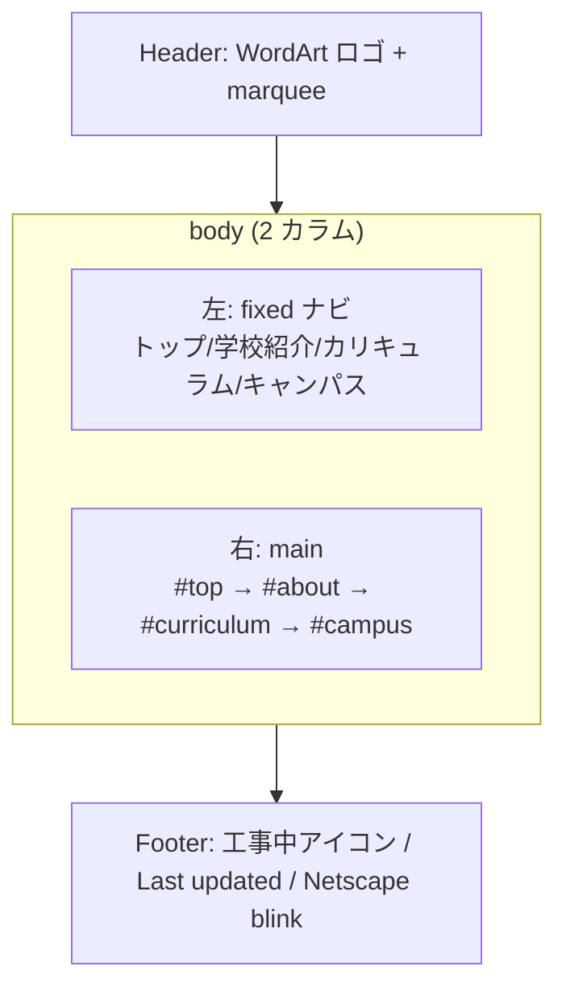

# Design: 神山まるごと高専 90年代風紹介ページ

## 実行戦略

Confidence Score は **90%（高）** のため、PoC を経ず、包括的な一気通貫実装で進める。

## アーキテクチャ

純粋な静的サイト。ビルド工程なし。GitHub Pages が `main` ブランチのルートを配信する。

```
ブラウザ ──HTTP GET──▶ GitHub Pages (main / root)
                        ├── index.html         （構造・コンテンツ）
                        ├── assets/css/style.css （90年代風スタイル）
                        ├── assets/js/script.js  （うるさい挙動）
                        └── .nojekyll           （Jekyll 無効化）
```

### ファイル構成

| パス | 役割 |
|------|------|
| `index.html` | 単一ページ本体。全セクションをアンカーで接続。 |
| `assets/css/style.css` | 90 年代風デザイン。`@keyframes`・ビベル枠・タイル背景。 |
| `assets/js/script.js` | alert、カウンター、カーソルキラキラ、タイトル点滅、marquee フォールバック。 |
| `.nojekyll` | 空ファイル。Jekyll 処理を無効化。 |
| `README.md` | 概要・URL・ローカル確認手順・出典注意書き。 |

## ページレイアウト



### セクション内容

| ID | 見出し | 主なコンテンツ | 背景色 |
|----|--------|----------------|--------|
| `#top` | 神山まるごと高専 | 巨大点滅タイトル、アクセスカウンター | マゼンタ |
| `#about` | 学校紹介 | 理念、2023 年開校、私立・5 年制 | ライム |
| `#curriculum` | カリキュラム／学科 | デザイン・エンジニアリング学科、全寮制、PBL | シアン |
| `#campus` | キャンパス／アクセス | 徳島県名西郡神山町、旧校舎再生、徳島空港からのアクセス | イエロー |

## インターフェース

### HTML（index.html の主要骨格）

```html
<!doctype html>
<html lang="ja">
  <head>
    <meta charset="utf-8" />
    <meta name="viewport" content="width=device-width, initial-scale=1" />
    <title>✨神山まるごと高専✨</title>
    <link rel="stylesheet" href="assets/css/style.css" />
  </head>
  <body>
    <header><!-- WordArt ロゴ + marquee --></header>
    <nav class="sidebar"><!-- 固定ナビ --></nav>
    <main>
      <section id="top">...</section>
      <section id="about">...</section>
      <section id="curriculum">...</section>
      <section id="campus">...</section>
    </main>
    <footer>...</footer>
    <script src="assets/js/script.js"></script>
  </body>
</html>
```

### CSS 主要クラス／キーフレーム

| セレクタ | 役割 |
|----------|------|
| `body` | 深紫背景 + 星空 SVG タイル、Comic Sans 系フォントスタック |
| `.wordart` | 虹色グラデ + 縁取り + drop-shadow |
| `.blink` | `@keyframes blink { 50% { visibility: hidden; } }` |
| `.bevel` | `border: 6px outset #c0c0c0;` |
| `.counter` | 黒地 + 赤デジタル風 + `font-family: monospace` + `text-shadow` |
| `.under-construction` | CSS のみの黄黒縞三角形 + 回転アニメ |
| `.sparkle` | JS が動的生成、`position: fixed` + fade-out transition |

### JavaScript モジュール設計（script.js 内の関数）

| 関数 | 責務 | 参照要件 |
|------|------|----------|
| `showWelcomeAlert()` | 初回ロード時 alert | R-5.1 |
| `initVisitCounter()` | localStorage 読取／書込、7 桁表示 | R-5.3, R-5.6 |
| `attachSparkleTrail()` | mousemove で ✨ 生成 | R-5.2 |
| `startTitleBlink()` | `setInterval` で `document.title` 切替 | R-5.5 |
| `polyfillMarquee()` | `HTMLMarqueeElement` 未定義時に CSS アニメ付与 | R-5.4 |

## データモデル

localStorage のみ使用。

| キー | 型 | 例 | 説明 |
|------|----|-----|------|
| `kmc_visit_count` | 文字列（数値） | `"42"` | 訪問回数。読み取り時に数値化しインクリメント。 |

## エラーハンドリング

| エラー | 発生箇所 | 対応 |
|--------|----------|------|
| `localStorage` アクセス拒否（プライベートモード等） | `initVisitCounter` | try/catch で握り、`0000001` 表示にフォールバック |
| `<marquee>` 非対応 | レンダリング時 | `typeof HTMLMarqueeElement === 'undefined'` を検知し CSS アニメ適用 |
| `document.title` の元値喪失 | `startTitleBlink` | 初期値をモジュールスコープ変数に保存して切替 |
| alert がブロックされる環境 | `showWelcomeAlert` | 例外を握り潰し、後続処理は続行 |

## テスト戦略（手動中心）

ビルド／自動テストは用いず、手動チェックリストで検証する（詳細は tasks.md の Verification）。

1. ローカルで `index.html` を直接ブラウザで開く
2. DevTools Console でエラーなし確認
3. GitHub Pages 公開後、公開 URL で同等チェック
4. 375px 幅（モバイルエミュレーション）でも本文が読める

## 決定事項

### Decision - 2026-04-22
- **Decision**: ビルドレス純静的サイト構成（HTML/CSS/JS 直置き）
- **Context**: GitHub Pages の単純配信のみで十分。90 年代再現に近代ツールは不要。
- **Options**:
  - A) Jekyll 利用 → テーマ介入で 90 年代演出が阻害される恐れ。
  - B) Vite 等バンドラ → 本件の規模・目的に対し過剰。
  - C) 純静的 + `.nojekyll` → 最小摩擦・意図通り。
- **Rationale**: 目的（90 年代 UI 再現）と配信要件（`main` / root）に最も整合。
- **Impact**: 依存管理が不要。差し替えもテキストエディタのみで完結。
- **Review**: 要件が拡張（多ページ化・動的データ）された時点で再検討。

### Decision - 2026-04-22
- **Decision**: 外部画像ゼロ、絵文字 + インライン SVG + CSS で表現
- **Context**: 画像配置のリスク（ライセンス・リンク切れ）を回避しつつ、90 年代演出の「うるさい」成分を維持したい。
- **Options**: 画像採用 / 絵文字・SVG 主体。
- **Rationale**: CDN 不要、リポジトリ軽量、差し替え容易。
- **Impact**: デザイン表現は CSS 技巧に依存するが演出許容範囲。
- **Review**: 公式画像提供を受けた時点で再検討。

### Decision - 2026-04-22
- **Decision**: 掲載情報は一般公知情報に限定し、不確定項目は「公式サイト参照」と明記
- **Context**: 誤情報掲載は学校・運営の信頼を損なう。
- **Options**: 詳細網羅 / 最小限 + 公式リンク誘導。
- **Rationale**: 後差し替え前提のため初期段階で誤情報を避ける方が安全。
- **Impact**: 情報量は抑えめ。構造はそのままに文言を差し替え可能。
- **Review**: 正式原稿を受領した際に改訂。
