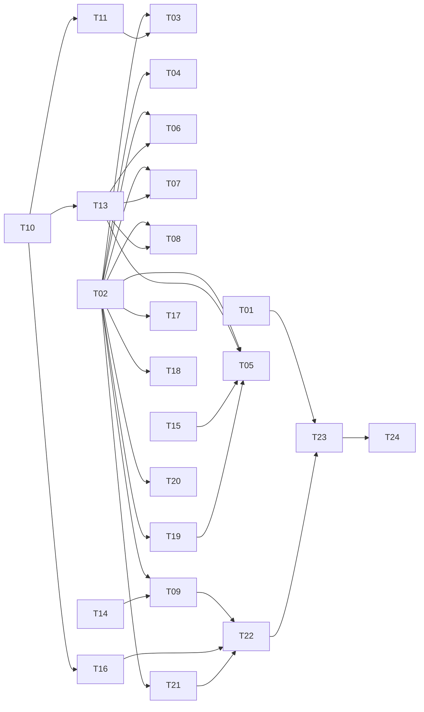

# Tasks: 神山まるごと高専 90年代風紹介ページ

各タスクは `[ ]` 未着手 / `[x]` 完了。要件 ID は `spec/requirements.md` を参照。

## Phase 1: 土台

- [x] **T-01** `.nojekyll`（空ファイル）をリポジトリルートに作成  
  - 期待結果: Jekyll 処理が無効化される  
  - 依存: なし / 参照: R-1.2
- [x] **T-02** `index.html` スケルトン作成（`<html lang="ja">`、meta、title に絵文字、CSS/JS 読み込み）  
  - 期待結果: 最小ページがブラウザで表示される  
  - 依存: なし / 参照: R-2.1, R-6.1

## Phase 2: ページ構造

- [x] **T-03** ヘッダー実装: 虹色 WordArt 風ロゴ（SVG + CSS）、`<marquee>` 歓迎メッセージ  
  - 参照: R-2.4, R-4.3
- [x] **T-04** 左サイド固定ナビ実装（トップ／学校紹介／カリキュラム／キャンパス・アクセス、ビベル枠）  
  - 参照: R-2.3, R-2.6, R-4.5
- [x] **T-05** `#top` セクション: 巨大点滅タイトル + アクセスカウンター枠  
  - 参照: R-2.2, R-4.4, R-4.8
- [x] **T-06** `#about` セクション: 理念・開校年・5 年制など暫定テキスト  
  - 参照: R-3.1, R-3.4
- [x] **T-07** `#curriculum` セクション: 学科・全寮制・PBL テキスト  
  - 参照: R-3.2, R-3.4
- [x] **T-08** `#campus` セクション: 所在地・旧校舎再生・徳島空港アクセステキスト  
  - 参照: R-3.3, R-3.4
- [x] **T-09** フッター実装: 工事中アイコン、Last updated、Netscape blink メッセージ  
  - 参照: R-2.5, R-4.7

## Phase 3: スタイル（`assets/css/style.css`）

- [x] **T-10** body 基本: 深紫背景 + 星空 SVG タイル + フォントスタック（Comic Sans / MS P ゴシック）  
  - 参照: R-4.1, R-4.2
- [x] **T-11** WordArt 見出し（虹色グラデ + 縁取り + drop-shadow）  
  - 参照: R-4.3
- [x] **T-12** `.blink` キーフレーム定義  
  - 参照: R-4.4
- [x] **T-13** セクション枠ビベル 3D ボーダー + 毒々しい色別背景  
  - 参照: R-4.5, R-4.6
- [x] **T-14** 工事中アイコン（CSS only 黄黒縞三角形 + アニメ）  
  - 参照: R-4.7
- [x] **T-15** アクセスカウンタースタイル（黒地 + 赤デジタル風）  
  - 参照: R-4.8
- [x] **T-16** リンク色: 青下線 / 訪問済み紫 / ホバー点滅  
  - 参照: R-4.9

## Phase 4: 挙動（`assets/js/script.js`）

- [x] **T-17** 初回ロード alert  
  - 参照: R-5.1
- [x] **T-18** カーソル追従キラキラ ✨  
  - 参照: R-5.2
- [x] **T-19** アクセスカウンター（localStorage + 7 桁ゼロパディング + フォールバック）  
  - 参照: R-5.3, R-5.6
- [x] **T-20** `<marquee>` 非対応時の CSS アニメフォールバック  
  - 参照: R-5.4
- [x] **T-21** `document.title` 点滅  
  - 参照: R-5.5

## Phase 5: 仕上げ

- [x] **T-22** `README.md` 更新（概要・公開 URL・ローカル確認手順・出典暫定の注意・Pages 設定手順）  
  - 参照: R-6.4
- [ ] **T-23** GitHub Pages 設定（Settings → Pages → Source: `main` / `(root)`）  
  - 参照: R-1.1, R-1.3
- [ ] **T-24** 公開 URL アクセス確認  
  - 参照: R-1.3

## Verification チェックリスト

ローカル（`index.html` をブラウザで直接オープン）:

- [ ] V-1 ロード時に alert が表示される（R-5.1）
- [ ] V-2 `<marquee>` テキストが流れる（R-2.4, R-5.4）
- [ ] V-3 `.blink` テキストが点滅する（R-4.4）
- [ ] V-4 背景が星空タイル（R-4.1）
- [ ] V-5 カーソル追従キラキラが動く（R-5.2）
- [ ] V-6 カウンターが表示され、リロードで値が増える（R-5.3）
- [ ] V-7 ナビリンクで各セクションへアンカー遷移できる（R-2.6）
- [ ] V-8 DevTools Console に JS エラーが出ない（R-6.2）
- [ ] V-9 375px 幅でも本文が読める（R-6.3）

公開後:

- [ ] V-10 `https://yamasora1006k.github.io/ghcp-school-intro-260422/` にアクセスして index.html が表示される（R-1.3）
- [ ] V-11 `.nojekyll` が有効化されている（ディレクトリのまま配信されている）（R-1.2）

## Dependencies

## Decisions

### Decision - 2026-04-22
- **Decision**: 自動テストを設けず、Verification は手動チェックで完結
- **Context**: 静的 HTML 1 枚 + 演出重視で、E2E テスト導入コストが便益を超える。
- **Options**: Playwright 導入 / 手動チェック。
- **Rationale**: 規模・目的に対し手動で十分。依存追加ゼロを維持。
- **Impact**: 回帰検出は手動依存。将来ページ増加時に要再検討。
- **Review**: コンテンツ多ページ化または差し替え頻度増時に再検討。
